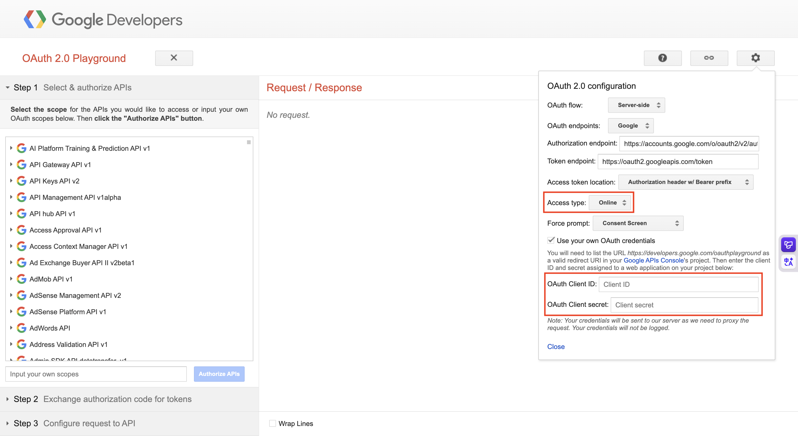
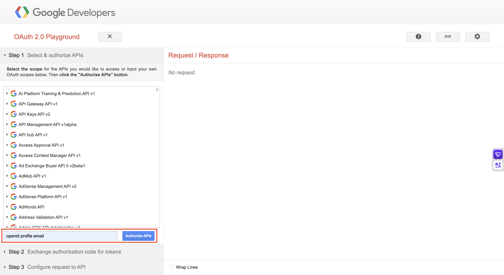
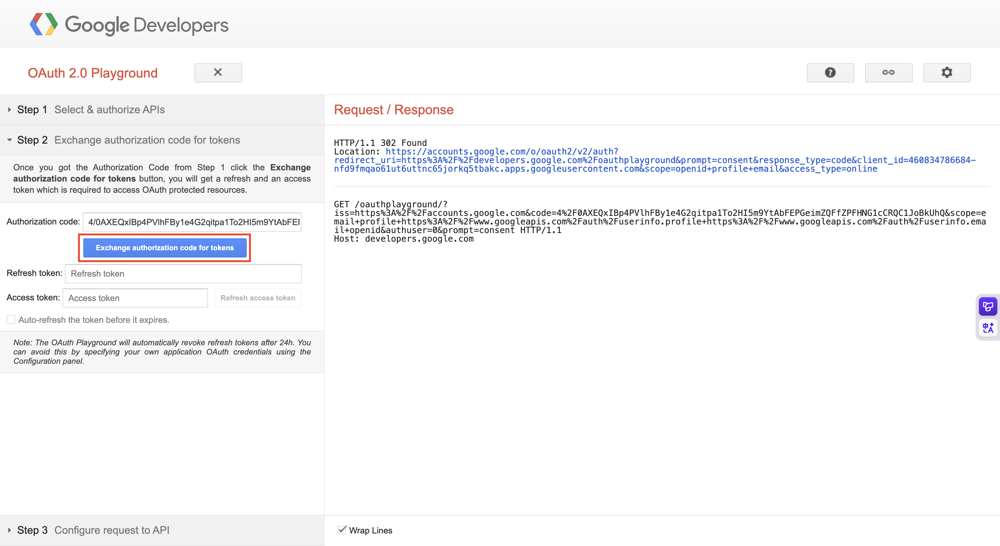
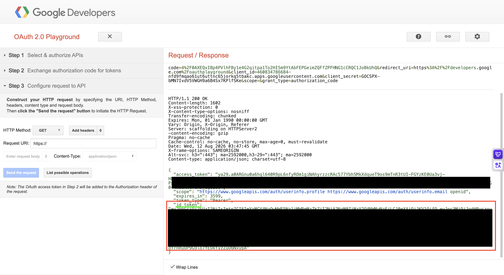

# Swagger에서 Google 로그인 테스트하기

아래 절차를 따라 OAuth 2.0 Playground에서 Google 인증 토큰을 발급한 뒤, Swagger에서 Google 로그인을 테스트할 수 있습니다.

### 1. OAuth 2.0 Playground 접속

[OAuth 2.0 Playground](https://developers.google.com/oauthplayground/)에 접속합니다.

### 2. OAuth 클라이언트 정보 설정

화면 오른쪽 상단의 설정을 열고 다음 항목을 입력합니다.



- `Access type`을 `Online`으로 설정합니다.
- `Use your own OAuth credentials`를 활성화합니다.
- `OAuth Client ID`와 `OAuth Client secret`에 각각 값을 입력합니다.

### 3. Step 1에서 사용할 스코프 설정

Step 1의 스코프 입력란에 아래 값을 그대로 입력합니다.



```
openid profile email
```

입력한 후 `Authorize APIs`를 클릭합니다.

### 4. Step 2에서 인증 코드로 토큰 발급

Step 2로 이동한 뒤, `Exchange authorization code for tokens`를 클릭합니다.



### 5. `id_token` 복사

토큰 발급이 완료되면 응답에 포함된 `id_token`을 확인합니다.



- 발급된 `id_token` 값을 그대로 복사해 Swagger에서 사용합니다.
- 이미지에 포함된 민감한 정보는 가려져 있습니다.
